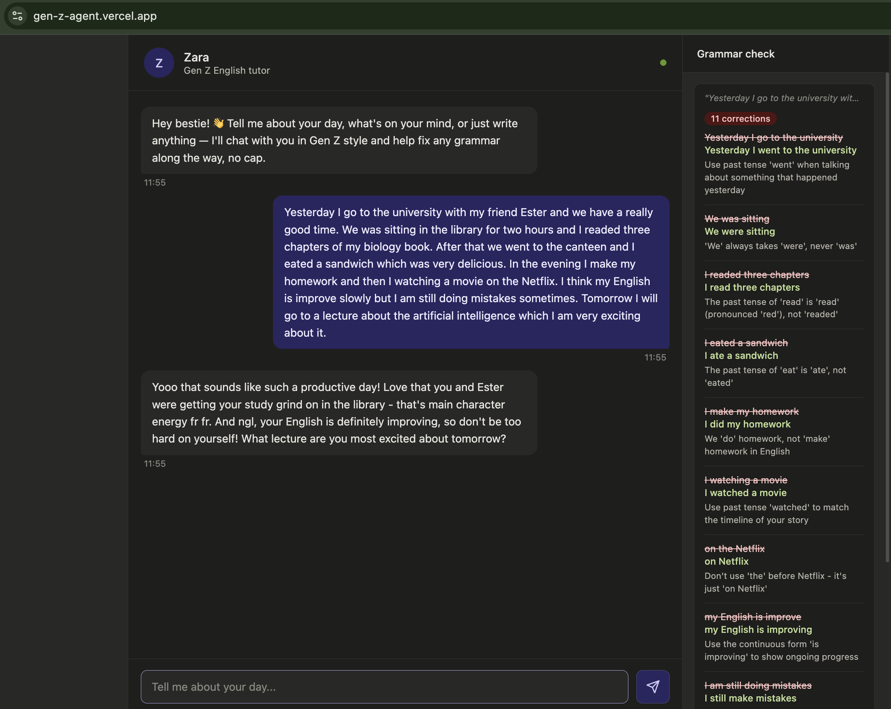

# Gen Z English Tutor

A FastAPI backend that powers a Gen Z English tutor using the Claude API.

## Tech stack
- **Backend:** Python, FastAPI, Anthropic Claude API
- **Frontend:** Vanilla HTML/CSS/JS
- **Deployed on:** Railway (API) + Vercel (frontend)

## Setup

### 1. Create a virtual environment
```bash
python -m venv venv
source venv/bin/activate        # Mac/Linux
venv\Scripts\activate           # Windows
```

### 2. Install dependencies
```bash
pip install -r requirements.txt
```

### 3. Set up your API key
```bash
cp .env.example .env        # Mac/Linux
copy .env.example .env      # Windows
# Now open .env and paste your Anthropic API key
# Get one at: https://console.anthropic.com/
```

### 4. Run the server
```bash
uvicorn main:app --reload --port 8000
```

The API will be available at `http://localhost:8000`

---

## API Endpoints

### `GET /`
Health check — confirms the server is running.

### `POST /chat`
Send a message and get a Gen Z reply + grammar corrections.

**Request body:**
```json
{
  "message": "Yesterday I go to the market and buyed some apples.",
  "history": []
}
```

**Response:**
```json
{
  "reply": "Omg bestie the apple era is so real, no cap! 🍎 What did you make with them?",
  "corrections": [
    {
      "original": "I go to the market",
      "corrected": "I went to the market",
      "explanation": "Use past tense 'went' when talking about something that already happened yesterday."
    },
    {
      "original": "buyed",
      "corrected": "bought",
      "explanation": "'Buy' is an irregular verb — its past tense is 'bought', not 'buyed'."
    }
  ],
  "no_errors": false,
  "raw_message": "Yesterday I go to the market and buyed some apples."
}
```

### Passing conversation history
To keep context across multiple turns, pass previous messages in the `history` array:

```json
{
  "message": "It was really fun!",
  "history": [
    { "role": "user", "content": "Yesterday I went to the market." },
    { "role": "assistant", "content": "{\"reply\": \"That's a vibe fr!\", \"corrections\": [], \"no_errors\": true}" }
  ]
}
```

---

## Project Structure

```
genz-tutor-backend/
├── main.py          ← FastAPI app + /chat endpoint
├── models.py        ← Pydantic request/response models
├── prompt.py        ← System prompt (Zara's personality)
├── requirements.txt
├── .env.example
└── README.md
```

## Customising the tutor

The entire personality lives in `prompt.py`. You can:
- Change the name from "Zara" to whatever you like
- Adjust how many corrections per message (currently max 3)
- Change the slang style (e.g. more formal corrections, different dialect)
- Add a native language hint (e.g. "The user is a native Portuguese speaker — watch for article errors")



## Live demo
[gen-z-agent.vercel.app](https://gen-z-agent.vercel.app)